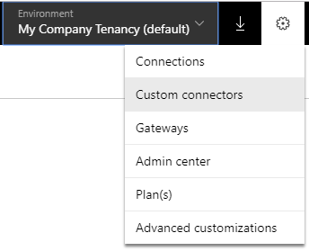
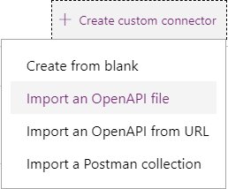
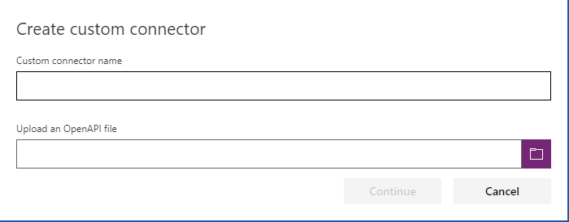
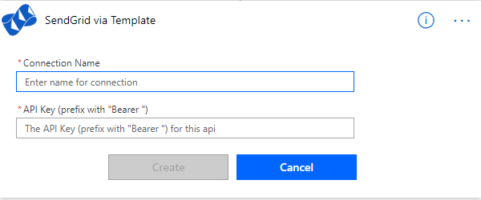
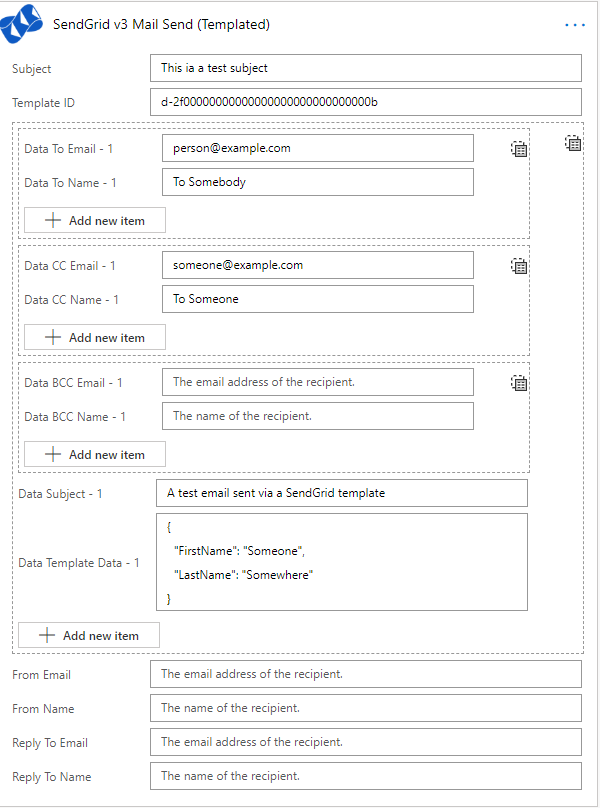

# SendGrid (By Template) for Microsoft Flow and PowerApps Swagger / OpenAPI definition

SendGrid v3 API Swagger file for sending transactional templated emails from Microsoft Flow and PowerApps. 

Based on the full version of the [SendGrid Open API/Swagger definition](https://github.com/sendgrid/sendgrid-oai)

To use, you can create a new custom connection in Microsoft PowerApps and use that within Microsoft Flow.

Step 1: Go to Custom Connectors in your PowerApps tenancy.

Step 2: Hit Create Connection

Step 3: Upload the [Swagger file](SendGrid%20v3%20API%20-%20Mail%20Send%20(Templated)%20-%20Swagger.json).

Step 4: Add this to your Microsoft Flow

The API Key you get from SendGrid needs to be prifixed with the word "Bearer", e.g. "Bearer SG.lksfjlsiejleijclkaio032-09234ljslja39lkjdalkj". Failure to do this will cause Flow to fail with an unauthorised exception.

Step 5: Use within your Microsoft Flow

